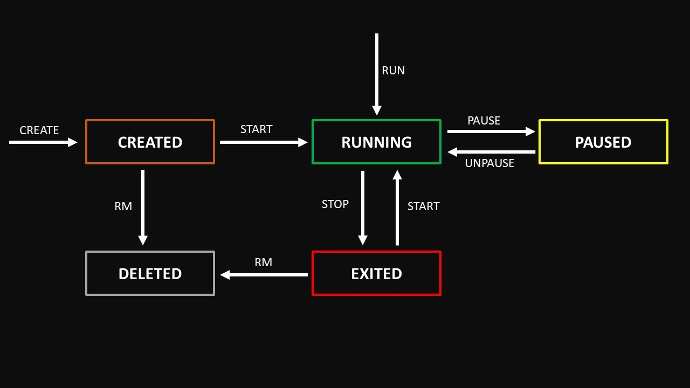

# [Docker and Kubernetes: The Complete Guide](https://www.udemy.com/course/docker-and-kubernetes-the-complete-guide/)

### Udemy course by [Stephen Grider](https://www.linkedin.com/in/stephengrider/)

### Summary
- Docker
  - [Manipulating Containers with the Docker Client](#manipulating-containers-with-the-docker-client)
  - [Building Custom Images Through Docker Server](#building-custom-images-through-docker-server)
  - [Demo: Create a Node Server managed by Docker](#demo-create-a-node-server-managed-by-docker)
  - [Demo: Manage Multiple Containers with Docker Compose](#demo-manage-multiple-containers-with-docker-compose)
  - [Demo: Create a Workflow with Docker, Github, Travis and AWS](#demo-create-a-workflow-with-docker-github-travis-and-aws)
- Kubernetes

## Container Lifecycle


## Manipulating Containers with the Docker Client

Here is some of the basic commands we use in Docker.  
Always use as a base the [Docker Documentation](https://docs.docker.com/).

```bash
  # Run a container (download image, create and start if not exists)
  docker run <image-name> <extra-command>
  #Example
  docker run busybox echo hi there

  # Start an already created container
  docker start <image-name>
  #Example
  docker start busybox

  # List running containers
  docker ps

  # List all created containers
  docker ps -a

  # List containers and show their size
  docker ps -s

  # List running containers (full command)
  docker container ls

  # List containers (full command)
  docker container ls -a

  # Show logs from a specific container
  docker logs <container-id>

  # Stop a container
  docker stop <container-id>

  # Kill a container
  docker kill <container-id>

  # Pause a container
  docker pause <container-id>

  # Unpause a container
  docker unpause <container-id>

  # Remove a container
  docker rm <container-id>
  
  # List images
  docker images

  # Remover a specific image
  docker image rm <image-id>

  # Stop all the containers (using a chained command to list all the containers)
  docker stop $(docker container ls -q)

  # Remove all the containers (using a chained command to list all the containers)
  docker container rm $(docker container ls -aq)

  # Remove all the images (using a chained command to list all the images)
  docker rmi $(docker image ls -aq) --force

  # Remove all containers and images
  docker system prune
```

### Demo: Working with Redis Database in Docker

In this demo, we will learn how to quickly set up and interact with a **Redis database** using Docker.  
Redis is an in-memory key-value store widely used for caching, session management, and real-time data processing.  
With Docker, you can spin up a Redis instance in seconds without needing to install it directly on your machine.

```bash
  # Create and run a redis image container
  docker run redis

  # In another terminal, get the redis container id
  docker ps

  # them execute the container on interactive mode (attach the terminal as STDIN process into the container) with the redis-cli command
  docker exec -it <container-id> redis-cli

  # Access the container in interative mode with a bash
  docker exec -it <container-id> sh

  # A better way to create the container in interative mode with a bash
  docker run -it redis sh
```

## Building Custom Images Through Docker Server

In this demo, we will learn how to build **custom Docker images** from scratch instead of relying only on pre-built ones from Docker Hub.  
By creating a `Dockerfile`, you can define the base image, install dependencies, and configure how the container should behave when it starts.  

1. Create a Dockerfile

```dockerfile
# Use and docker image as a base
FROM alpine:latest

# Download and install dependencies
RUN apk add --update redis

RUN apk add --update gcc

# Configure what to do and when to start the container
CMD ["redis-server"]
```

2. Execute `docker build pedropadilhaportella/redis:latest .` to generate an image with a specific tag.

3. Execute `docker run pedropadilhaportella/redis` to run the image you generated.

If you forget to set a tag, ou can add it later by executing:

```bash
  docker tag <container-id> pedropadilhaportella/redis:latest
```

Also you can create an image from a specific container by executing:

```bash
  docker commit -c "CMD ['redis-server']" <container-id>
```


## Demo: Create a Node Server managed by Docker

This demo shows how to create a simple Node.js server with **Express**, containerize it with **Docker**, and run it locally. You can see all the files [here](https://github.com/PedroPadilhaPortella/Docker_And_Kubernetes/blob/main/demo-node-server-docker/Readme.md).


## Demo: Manage Multiple Containers with Docker Compose

This demo shows how to create a Node.js server with Express, connect it to Redis, and run everything using Docker Compose. You can see all the files [here](https://github.com/PedroPadilhaPortella/Docker_And_Kubernetes/tree/main/demo-multiple-containers-docker-compose/Readme.md).


## Demo: Create a Workflow with Docker, Github, Travis and AWS

This demo shows how to build and deploy a React application into AWS using Docker and Docker Compose, while setting up CI/CD pipelines with both GitHub Actions and Travis CI. You can see all the files [here](https://github.com/PedroPadilhaPortella/Docker_And_Kubernetes/tree/main/demo-docker-react/Readme.md).
